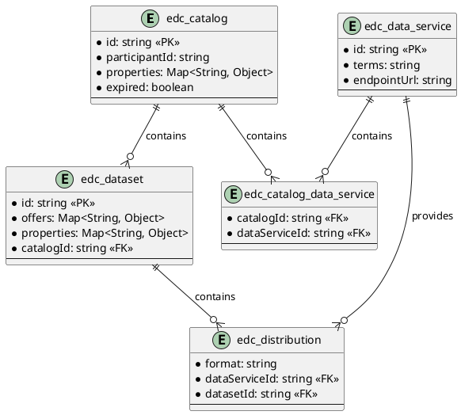

# SQL Federated Catalog

Provides SQL persistence for federated catalog.

## Prerequisites

Please apply this [schema](docs/schema.sql) to your SQL database.

## Entity Diagram

<!--

-->

## Configuration

| Key                                  | Description                                | Mandatory | 
|:-------------------------------------|:-------------------------------------------|---|
| edc.datasource.federatedCatalog.name | Datasource used to store federated catalog | X |
