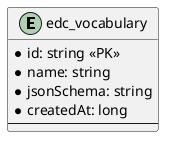

# SQL Vocabulary

Provides SQL persistence for vocabularies.

## Prerequisites

Please apply this [schema](docs/schema.sql) to your SQL database.

## Entity Diagram

<!--

-->

## Configuration

| Key | Description | Mandatory | 
|:---|:---|---|
| edc.datasource.vocabulary.name | Datasource used to store vocabularies | X |
